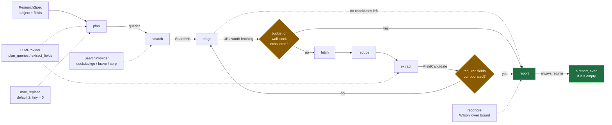
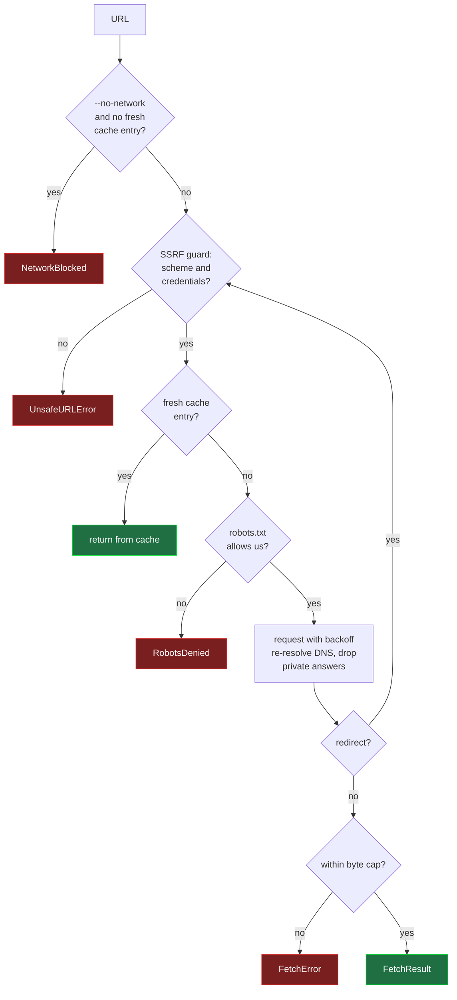
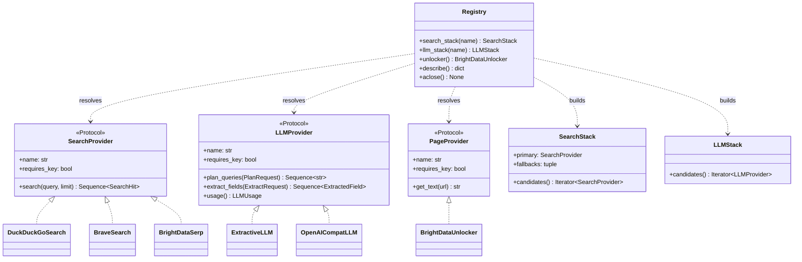
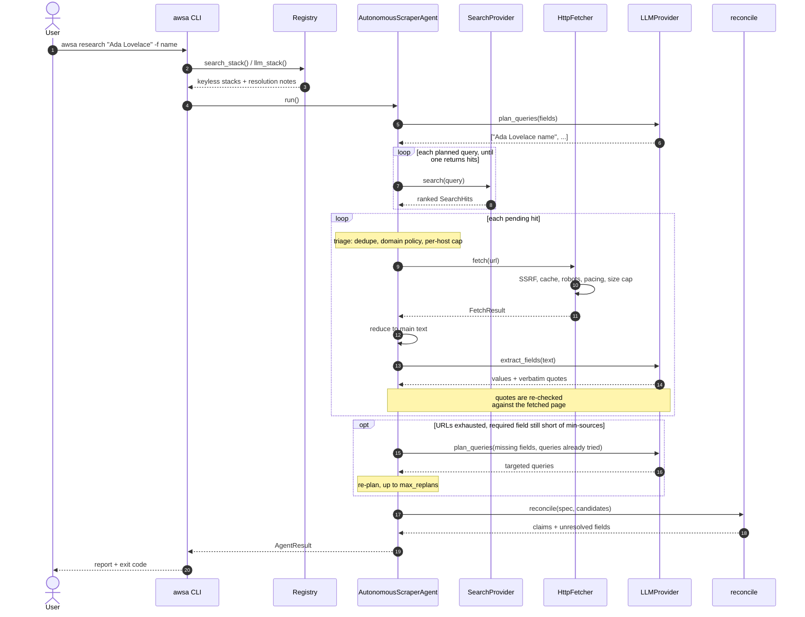
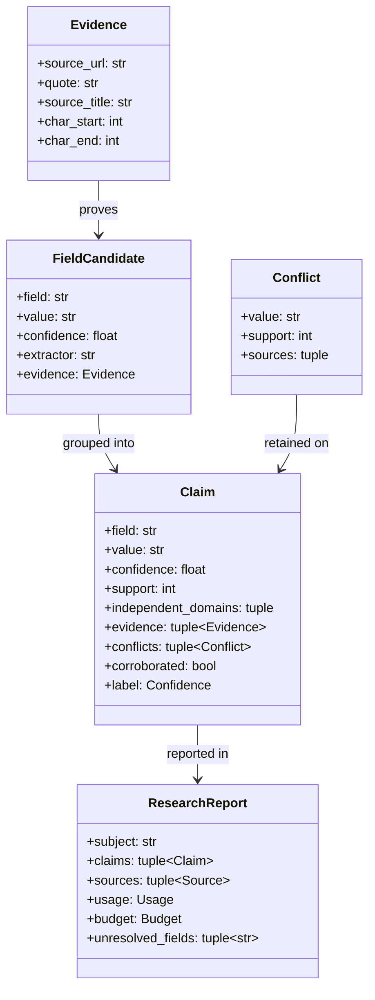

# awsa — autonomous web scraper agent

**Research agent that shows its work.** It plans search queries, reads pages
politely, extracts structured facts, and attaches a verbatim quote and a URL to
every value it reports — then tells you how much to trust it.

Most "AI scraping" demos hand you a JSON blob and ask you to trust it. This one
hands you a table with confidence scores, a corroboration count, and a clickable
quote behind every row.

It also runs with **zero configuration and zero API keys**. Clone, install,
run. Keys are an upgrade, not a requirement.

```console
$ awsa "Grace Hopper" -f name -f birth_date -f bio -f city
```

Illustrative output — note that every value carries the quote and URL it came
from, and that a single-source field is visibly weaker than a corroborated one:

```text
# Research report: Grace Hopper

4/4 fields answered · 2 corroborated by 2+ domains · 6 page(s) read · 8.4s

## Claims

| Field      | Value                                     | Confidence | Sources | Corroborated |
| ---------- | ----------------------------------------- | ---------- | ------- | ------------ |
| name       | Grace Brewster Murray Hopper               | HIGH 0.86  | 4       | yes          |
| birth_date | December 9, 1906                           | HIGH 0.81  | 3       | yes          |
| bio        | Computer scientist and United States Navy…  | MED  0.62  | 2       | yes          |
| city       | New York                                   | LOW  0.31  | 1       | no           |

## Evidence

### city
- > Hopper was born in New York City, New York.
  — [Grace Hopper](https://example.org/grace-hopper)
```

The `city` row is the point of the whole design. One source, no corroboration,
`LOW` — even though the extractor was sure. A tool that reported four
confident-looking values would have hidden that difference from you.

---

## Why this is different

| | Typical demo | awsa |
| --- | --- | --- |
| Installs and runs on a fresh clone | Needs a paid key to do anything | **Yes — every command works with no keys** |
| Search quality | a key you must have | **honest about it: keyless is best-effort, keys are better** |
| Evidence | none, or one URL | **verbatim quote + URL + char offset, per value** |
| Confidence | invented | **Wilson lower bound on cross-source agreement** |
| Prompt injection | unhandled | **untrusted page text is delimited and instructed to never be obeyed** |
| SSRF | unhandled | **scheme, credential, and resolved-IP checks on every request and redirect** |
| robots.txt | ignored | **RFC 9309 parsing, honoured on every hop** |
| Politeness | none | **per-host pacing, jittered backoff, `Retry-After`, crawl-delay, cache with ETag revalidation** |
| Cost control | unbounded | **six independent budgets incl. wall clock; always returns a partial report** |
| Vendor lock-in | one hardcoded SDK | **five providers behind three Protocols; `auto` picks and degrades** |
| Testable | needs the network | **full suite runs against a local fixture server, no network** |

> **A word of honesty about keyless search.** Everything in this tool runs
> without an API key, but the *search* step is the weak point: DuckDuckGo's
> anonymous endpoint rate-limits and bot-challenges unidentified clients, and
> when it does, `awsa` tells you so explicitly and points at the fix instead of
> quietly reporting zero results. For unattended or repeated use, set
> `AWSA_BRAVE_API_KEY` (free tier is available). Fetching, extraction,
> reconciliation, reporting and every other stage are unaffected — and
> `awsa fetch <url>` needs no key at all.

### Two different meanings of "offline"

These get confused, so the tool gives them different flags:

| Flag | Effect | Still uses the network? |
| --- | --- | --- |
| `--offline` | ignores hosted/paid providers and uses the keyless stack | **Yes** — search and fetch work |
| `--no-network` | refuses to open any socket at all | **No** — answers come from a warm cache |

`--no-network` implies `--offline`, since a run that cannot reach the network
cannot call a hosted model either. It is enforced in one place, at HTTP
transport level, so it applies to the fetcher, the search providers and the LLM
adapters alike — a provider cannot quietly re-enable the network. Cached pages
remain readable, so an air-gapped run can still answer questions it has answered
before.

---

## Install

```console
git clone https://github.com/ogc16/web-scraper
cd web-scraper
pip install -e .
awsa doctor
```

Requires Python 3.11+. Two runtime dependencies: `httpx` and `platformdirs`.

---

## Usage

### Research

```console
# default fields
awsa research "Ada Lovelace"

# explicit fields, with hints that sharpen the query
awsa research "Ada Lovelace" \
  -f name \
  -f "employer:who she worked for" \
  -f "city:where she lived"

# machine-readable, written to disk
awsa research "Alan Turing" -f name -f birth_date -f employer --format json -o out.json

# only trust these domains
awsa research "Ada Lovelace" --include-domain en.wikipedia.org --include-github.com
```

`awsa "Ada Lovelace"` works too — `research` is the default subcommand.

### Inspect a single page

```console
awsa fetch https://example.com            # readable text
awsa fetch https://example.com --json     # title, strategy, score, links
awsa fetch https://example.com --raw      # untouched HTML
```

### Check a site's rules before scraping it

```console
awsa robots https://example.com/private/thing
# example.com: DENIED (disallowed by '/private')
```

### See which providers resolved, and why

```console
$ awsa providers
search providers (in fallback order):
  - brave  [key required]
  - duckduckgo  [no key needed]
llm providers (in fallback order):
  - openai:gpt-4o-mini  [key required]
  - extractive  [no key needed]
```

### Exit codes

`0` found something · `1` ran cleanly but found nothing · `2` bad usage or config ·
`3` blocked by policy (robots.txt, the SSRF guard, or `--no-network`) ·
`4` every provider failed.

---

## Configuration

Everything is optional. Set only what you need.

| Variable | Effect when set |
| --- | --- |
| `AWSA_OPENAI_API_KEY` | uses an OpenAI-compatible model for planning and extraction |
| `AWSA_OPENAI_BASE_URL` | points at Azure, OpenRouter, Groq, Ollama, vLLM, … |
| `AWSA_LLM_MODEL` | model id, default `gpt-4o-mini` |
| `AWSA_BRAVE_API_KEY` | uses Brave Search instead of the keyless endpoint |
| `AWSA_BRIGHTDATA_*` | enables the Web Unlocker and SERP API providers |
| `AWSA_CACHE_DIR` | persists the HTTP cache between runs |
| `AWSA_OFFLINE` | use no hosted or paid providers; keyless search and fetching still work |
| `AWSA_NO_NETWORK` | open no sockets at all; answers come from a warm cache only |
| `AWSA_RESPECT_ROBOTS` | set `false` to skip robots.txt (authorisation is your responsibility) |
| `AWSA_PER_HOST_DELAY` | minimum seconds between requests to one host |
| `AWSA_MAX_PAGES` / `AWSA_MAX_SEARCH_QUERIES` / `AWSA_MAX_WALL_SECONDS` | budget ceilings |
| `AWSA_LOG_LEVEL` | `DEBUG` … `CRITICAL` |

Copy `.env.example` if you prefer a file; the loader reads the process
environment, so use `python-dotenv run` or export the variables.

**Secrets are never hardcoded and never logged.** A redacting filter sits on the
`awsa` logger and masks anything shaped like a key, and `awsa providers` prints
`sk-1…(51 chars)` rather than the value.

---

## How it works

```
spec ──▶ plan ──▶ search ──▶ triage ──▶ fetch ──▶ reduce ──▶ extract ──▶ reconcile ──▶ report
        LLM       provider    domain     polite    main       LLM/        Wilson
                              policy     cached    content    structured   bounds
```

1. **Plan** — turn a subject and a list of fields into search queries.
2. **Search** — resolve queries to ranked URLs, trying providers in fallback order.
3. **Triage** — drop duplicates, enforce your domain policy, rank by intent.
4. **Fetch** — SSRF check, robots check, cache lookup, per-host pacing, retry with backoff.
5. **Reduce** — HTML to readable main content via text density, link density and class priors.
6. **Extract** — per page, propose values *with quotes*; publisher JSON-LD counts as stronger evidence.
7. **Reconcile** — group values across pages, weight independent domains over repeated pages, keep conflicts visible.
8. **Report** — Markdown, JSON or `field: value`, with confidence buckets.

The loop keeps fetching while required fields lack corroboration and stops on
coverage, budget, or the wall clock — **whichever comes first**. It always
returns a report, including a report with nothing in it.

When a round's candidate URLs run out but a required field is still short of
`--min-sources` independent domains, the loop **re-plans**: it tells the planner
which fields are missing and which queries it already tried, so the next round
aims at the gap. This costs nothing on a well-covered run, because re-planning
only happens on exhaustion. `--max-replans` caps the extra passes (default 2;
`--budget tiny` sets 0, since a second planner call is not affordable there).

### Pipeline



### Fetch safety gate

Every hop — the first request and each redirect — passes the same gates. A
failure at any of them is a skipped page, not a failed run.



### Provider seams

The agent depends on three Protocols, never on a concrete vendor. `Registry`
resolves each one from config and hands back an ordered stack, so a missing or
broken key degrades to the next candidate instead of aborting the run.



### One run, end to end



### Evidence model

Why a value is believed, and what would count against it.



Note what is *not* modelled: a path from `FieldCandidate` to `Claim` exists
only when its quote appears verbatim in the source text. A candidate whose quote
cannot be located is dropped before grouping, so an unquotable value cannot
reach the report.

### Confidence, specifically

`confidence` is not the model's self-reported score. It is:

```
wilson_lower_bound(support, agreeing_support)   # agreement, penalised for small n
  × 0.65  +  independent_domains / required  × 0.25
  +  best_extractor_score                    × 0.10
```

capped at `0.72` when a required field has fewer independent domains than you
asked for. A single page with a very confident extractor therefore cannot
produce a `high` claim — which is the entire point.

---

## Use it as a library

```python
import asyncio

from awsa import Budget, ResearchSpec
from awsa.agent import AutonomousScraperAgent
from awsa.config import Config
from awsa.report import render_markdown

spec = ResearchSpec.build(
    "Grace Hopper",
    ["name", "birth_date", "city"],
    budget=Budget.preset("standard"),
    min_independent_sources=2,
)

agent = AutonomousScraperAgent(Config(), spec)
result = asyncio.run(agent.run())

print(render_markdown(result.report))

for claim in result.report.claims:
    if claim.corroborated:
        print(claim.field, "->", claim.value, claim.independent_domains)
```

Fetch and reduce a page on its own:

```python
import asyncio
from awsa.config import Config
from awsa.extract import read_page
from awsa.net import HttpFetcher


async def main():
    async with HttpFetcher(Config()) as fetcher:
        result = await fetcher.fetch("https://example.com")
        print(read_page(result.final_url, result.body).text)


asyncio.run(main())
```

### Add a provider

Implement any two of the three Protocols in `awsa.providers.base` and register
it in `awsa.providers.registry`:

```python
class MySearch:
    name = "mysearch"
    requires_key = True

    async def search(self, query: str, *, limit: int = 10) -> Sequence[SearchHit]: ...

    async def aclose(self) -> None: ...
```

Nothing in the agent imports your class; the registry resolves it by name and
falls back automatically if it is unavailable.

---

## Development

```console
make dev         # editable install with dev extras
make test        # pytest, no network required
make lint        # ruff check + ruff format --check
make format      # ruff --fix + ruff format
make typecheck   # mypy (strict, src and tests)
make check       # lint + typecheck + test
make ci          # alias for check: exactly what CI runs
make build       # sdist + wheel
make verify-dist # install the built wheel in a throwaway venv and run it
make all         # ci, then build
```

CI runs the same three gates on Python 3.11, 3.12 and 3.13, then builds the
distributions and re-verifies the wheel from a clean environment, so a packaging
mistake cannot pass on an editable install.

The test suite starts a local fixture web server, so `make test` is hermetic
and deterministic. Network-dependent behaviour is tested against a real socket
loopback, not mocks, which is why the robots, redirect, retry and size-cap
paths are genuinely exercised.

Contributions are welcome — see [CONTRIBUTING.md](CONTRIBUTING.md) for the
conventions CI enforces, and [CODE_OF_CONDUCT.md](CODE_OF_CONDUCT.md) for the
ground rules.

---

## Support and security

- **Support** — [SUPPORT.md](SUPPORT.md). There is no SLA and there cannot be:
  this is a library you run yourself, not a hosted service. That page also lists
  the known limitations so they are not mistaken for bugs.
- **SLA template** — [SLA.md](SLA.md) is an unfilled template for a *hosted*
  offering. It is not in force, and the placeholders are deliberate. See §2 for
  why the self-hosted case has no availability figure at all.
- **Security** — [SECURITY.md](SECURITY.md) for the private reporting channel,
  the threat model in one page, and what is deliberately *not* defended.
- **Releases** — [releases](https://github.com/ogc16/web-scraper/releases). Each
  release attaches the built wheel and sdist, so you can install without
  building:

  ```console
  pip install https://github.com/ogc16/web-scraper/releases/download/v0.1.0/awsa-0.1.0-py3-none-any.whl
  ```

---

## Legal and ethical use

This tool reads public web pages. That does not make every use of it
appropriate.

- robots.txt is respected **by default**. Disabling it is a deliberate act.
- Requests are rate-limited per host and identify themselves via `User-Agent`.
  Set `AWSA_USER_AGENT` to something a human can contact.
- Do not use it for bulk personal-data collection, credential testing,
  bypassing access controls, or anything that violates a site's terms.
- You are responsible for compliance with the law that applies to you —
  GDPR, CCPA, CFAA and equivalents all differ by jurisdiction.

## Licence

MIT. See [LICENSE](LICENSE).

## Credits

This project merges two earlier demos by the same author — see
[CREDITS.md](CREDITS.md) for provenance and what changed.
